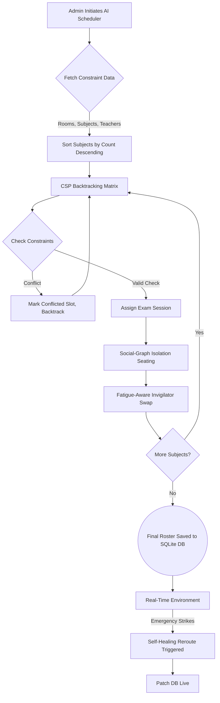

# AI Smart Exam Manager - Detailed Project Report

## 1. Introduction
The **AI Smart Exam Manager** is a comprehensive, intelligent web-based solution designed to automate and optimize the complex processes of educational institution administration. Specifically focusing on exam scheduling, resource allocation, and invigilation management, the system eliminates manual administrative overhead. Built with Python 3, Flask, and SQLite on the backend, alongside a responsive Single Page Application (SPA) utilizing HTML5, Vanilla CSS, and JavaScript, the application provides a seamless experience. 

It implements a robust role-based access control layer serving three primary user groups:
- **Admin (`AdminPro`)**: Full system configuration, AI-driven timetable scheduling, and emergency handling.
- **Teacher (`Teacher`)**: Viewing assigned invigilation duties, managing fatigue levels, and marking attendance.
- **Staff (`Staff`)**: Viewing non-teaching duty rosters and managing inventory supplies.

## 2. Literature Survey
Exam scheduling and resource management in educational institutions represent classical NP-hard problems, known in academic literature as the Examination Timetabling Problem (ETP). 
- **Timetabling & Constraint Satisfaction:** Traditional approaches rely heavily on manual entry or basic heuristic software. Academic implementations widely acknowledge the efficacy of **Constraint Satisfaction Problems (CSP)** equipped with backtracking algorithms to resolve strict operational limits (e.g., room capacities and preventing simultaneous exams in the same venue).
- **Academic Integrity:** Previous literature indicates that cheating often happens in pre-planned social clusters. While standard anti-cheating methods are reactive (e.g., post-exam answer analysis), advanced proactive systems leverage **Social Graph Theory** to disperse clustered students systematically across diverse testing environments.
- **Resource Reallocation:** Modern administrative frameworks emphasize the necessity of dynamic resilience. When emergencies occur (such as sudden faculty absence or facility breakdown), static schedules fail. Therefore, heuristic local search algorithms are required for real-time, **Self-Healing** capabilities.

## 3. Problem Statement
Managing a college examination season involves handling numerous interconnected variables, leading to severe logistical bottlenecks when done manually:
1. **Scheduling Conflicts:** Allocating exams without overlapping subjects, exceeding room physical capacities, or double-booking venues is computationally demanding and highly error-prone.
2. **Staff Exhaustion:** Manual invigilation distribution fails to account fairly for workload and fatigue factors, often leading to teachers being assigned back-to-back exhausting duties.
3. **Planned Malpractice:** Students belonging to the same social groups (friends or lab partners) frequently exploit room seating patterns to collaborate illicitly.
4. **Emergency Disruptions:** The sudden unavailability of an essential room or invigilator can derail an entire day's operations, lacking a swift operational pivot.
5. **Inventory Deficits:** Tracking exam supplies (like answer sheets or stationary) manually leads to critical shortages during active exams.

There is a definitive requirement for an automated, autonomous AI-based system that resolves constraints, isolates social clusters, balances staff workload equitably, and dynamically self-heals in real time.

## 4. Proposed System
The proposed system is a centralized web portal functioning on the Flask web framework, acting as an orchestrator for several custom-built Artificial Intelligence modules. Instead of relying on static mappings, it actively calculates the best-fit scenarios for assignments.

### 4.1 Algorithm
The underlying intelligence is driven by the `ai_engine.py` module, which contains several distinct algorithmic approaches:

1. **CSP Timetable Generator (Constraint Satisfaction Problem):**
   - *Logic:* Uses backtracking. It sorts subjects by student count (largest first) and iterates combinations of [Date] × [Time-Slot] × [Room].
   - *Constraints:* Room capacity ≥ student count; no temporal-spatial overlaps; no parallel same-branch exams.

2. **Social-Graph Isolation (Anti-Cheating):**
   - *Logic:* Group-aware seat distribution. Students sharing a matching `group_id` are distributed round-robin across different physical rooms. It actively breaks the "buddy system".

3. **Fatigue-Aware Duty Assignment:**
   - *Logic:* A Greedy Algorithm enforcing fatigue limits. It sorts teachers by `(duty_count, fatigue_score)` ascending. It skips invigilators who have served 2+ consecutive prior duties on the same day, assigning the least-loaded candidate dynamically.

4. **Self-Healing Emergency Re-routing (Heuristic Local Search):**
   - *Logic:* In case of an incapacitated room, it sorts available alternative rooms by capacity (best-fit strategy) and relocates the session atoms. If an invigilator is absent, their duties are immediately passed to the least-loaded available replacement without human intervention.

5. **Inventory Prediction (Linear Progression):**
   - *Logic:* Computes the continuous `usage_rate` to project `days_until_low`. It classifies urgency (Critical, Warning, Info) and recommends mathematically optimal restock quantities.

### 4.2 Flowchart



### 4.3 Block Diagram
The overall architectural segmentation is partitioned into three discrete layers:

```text
┌─────────────────────────────────────────────────────────────────┐
│                        AI EXAM MANAGER                          │
├─────────────────────────────────────────────────────────────────┤
│  1. LOGIN & AUTHENTICATION LAYER                                │
│  ┌──────────┐  ┌─────────────┐  ┌──────────────────┐            │
│  │  Admin   │  │   Teacher   │  │   Staff User     │            │
│  └────┬─────┘  └──────┬──────┘  └────────┬─────────┘            │
│       │               │                  │                      │
├───────▼───────────────▼──────────────────▼──────────────────────┤
│  2. APPLICATION BACKEND (app.py)                                │
│       Auth Routes | CRUD APIs | Data Import/Export              │
│                          │                                      │
│        ┌─────────────────┼─────────────────┐                    │
│        ▼                 ▼                 ▼                    │
│  ┌───────────┐   ┌──────────────┐   ┌──────────────┐            │
│  │ AI Engine │   │ Excel Handler│   │  SQLite DB   │            │
│  │ (Logic)   │   │ (I/O Module) │   │ (Models/ORM) │            │
│  └───────────┘   └──────────────┘   └──────────────┘            │
├─────────────────────────────────────────────────────────────────┤
│  3. FRONTEND SPA VIEW (HTML/JS/CSS)                             │
│  [ Dashboards ]  [ AI Setup Wizard ]  [ Emergency Triggers ]    │
└─────────────────────────────────────────────────────────────────┘
```

## 5. Code
The codebase is structured in a clear Model-View-Controller (MVC) derived pattern:

**Project Architecture Tree:**
```text
AI Smart Exam Manager/
├── app.py                    # Main Flask app (Routing, Auth, API core)
├── models.py                 # SQLAlchemy DB models (15 tables handling relational structure)
├── ai_engine.py              # Houses AI algorithms constraints & heuristics
├── excel_handler.py          # Facilitates templated importing/exporting of bulk data
├── requirements.txt          # Dependency management
├── exam_manager.db           # Persistent local DB auto-generated via SQLAlchemy
├── static/                   # Pure CSS styling and SPA JavaScript runtime
└── templates/                # Jinja2 HTML templates mapped per user-role
```

**Technical Stack Overview:**
- **Backend**: Python 3.x, Flask 3.x
- **Database**: SQLite3 via Flask-SQLAlchemy ORM
- **Authentication**: Session-based via Flask-Login
- **Data Exchange**: Pandas/openpyxl via Custom Excel Intermediary
- **Frontend Visualization**: Vanilla Javascript, CSS3, Google Fonts (Inter), Font Awesome 6, Chart.js 4 (via CDN).

## 6. Project Output
The functional output of the system manifests through detailed user interfaces and exportable spreadsheet reports:
- **Interactive Dashboards**: Visualizes resource health metrics, subject allocation distribution, and predictive inventory warnings upon login.
- **Bulk Import/Export Mechanism**: Admins can seed the entire college database spanning Rooms, Subjects, Students, and Teachers instantly using standard Excel template `.xlsx` files provided natively by `/api/template/`. Completed reports are downloaded back directly inside the browser.
- **Dedicated Portals**:
  - `Admin`: Controls the **AI Setup Wizard** rendering optimized timetables. Triggers emergency relocations.
  - `Teacher`: Personal dashboard to view duty locations and digitally register presence at the exam hall.
- **Attendance Sheets**: Automated rendering of structured Excel files holding mapping of Invigilator duties for print-out purposes.

**System Initialization:**
To begin experiencing the output, execute:
```bash
python app.py
```
And access the environment over `http://localhost:5000` executing as Admin (`AdminPro`:`admin@123`).

## 7. Conclusion
The AI Smart Exam Manager fundamentally transitions institutional scheduling from an ad-hoc, error-prone manual endeavor to a deterministic, optimized automated framework. By isolating social collusion networks, preventing teacher fatigue, providing real-time data I/O, and facilitating single-click emergency recovery algorithms, the system maximizes organizational efficiency. It scales dynamically accommodating institutions of varied size all while maintaining zero-setup database overhead.

## 8. References
1. Flask Web Development framework - [https://flask.palletsprojects.com/](https://flask.palletsprojects.com/)
2. SQLAlchemy Object Relational Mapper - [https://www.sqlalchemy.org/](https://www.sqlalchemy.org/)
3. Chart.js Data Visualization library - [https://www.chartjs.org/](https://www.chartjs.org/)
4. A. Schaerf (1999) "A Survey of Automated Timetabling" 
5. General foundations on Constraint Satisfaction Problem (CSP) programming techniques and Heuristic Based Local Backtracking searches.
